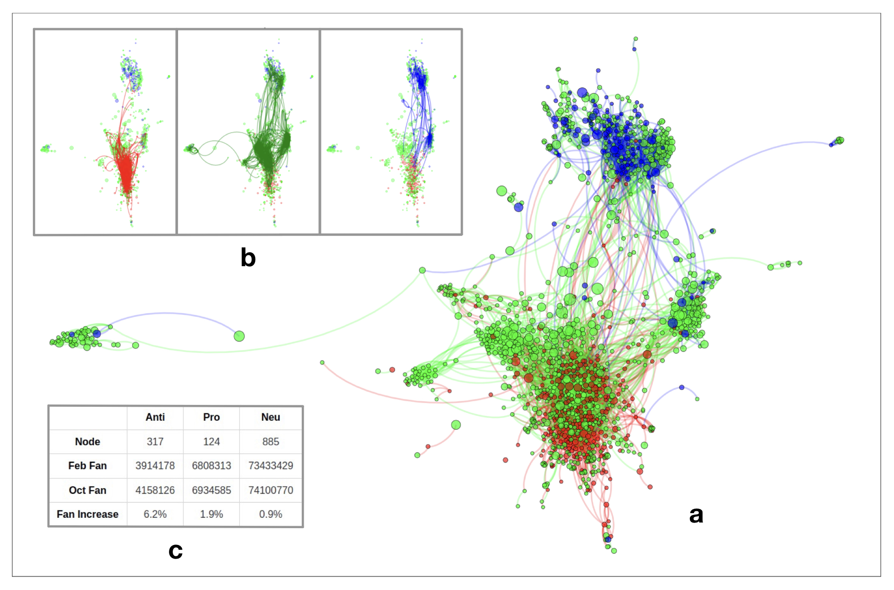

# MA4M4
MA4M4: Topics in Complexity Science

---

## Coding_Example_1
It is about **Network Structure**
- Import and generate networks
- Network Analysis: **adjacency matrix, degree, diameter, shortest path, clustering coefficient, closeness, betweeness**
&nbsp;

## Coding_Example_2
It is about **Random Graph**
- Watts Stogatz Random Graph
- Erdos Renyi Random Graph
- Configuration Model
&nbsp;

## Lab
Lab session involving both **Network Structure** and **Random Graph** (uncompleted).
&nbsp;

## Essay
### Data


The dataset provided by [Johnson et al.](https://www.nature.com/articles/s41586-020-2281-1) describes the snapshots of online competition between different vaccination views on February and October 2019, involving nearly 100 million individuals in Facebook from across countries, continents and languages. They can be represented by two networks with respect to different times in the following ways (see Figure above):

- Each node is a Facebook page with attribute fan size, that is the number of members who subscribe to the Facebook page, along with attribute polarity including anti-vaccination, pro-vaccination and neutral. Whereas its polarity remains the same for February and October snapshots, its fan size will change.
- An edge from node A to B means A recommends B to all its members at the page level, weighted by the fan size of B as a measure of influence. In addition, each snapshot record the accumulated recommendation data, which means edges existing in February snapshot must appear in October snapshot, but the other way around does not necessarily hold. Thus the other attribute of edge is a boolean value to denote whether it exist in February snapshot. 
&nbsp;

### Python Package Resource

- **ForceAtlas2**: https://github.com/bhargavchippada/forceatlas2
- **curved edges**: https://github.com/beyondbeneath/bezier-curved-edges-networkx
- **bow-tie detection**: https://github.com/alan-turing-institute/directedCorePeripheryPaper
- **infomap community detection**: https://cdlib.readthedocs.io/en/latest/reference/cd_algorithms/algs/cdlib.algorithms.infomap.html
&nbsp;

### Folder Structure 

```bash
Essay
¦   README.md   
¦   Visualization.ipynb            # using Python for data visualization
¦   Analysis.ipynb                 # using Python for data analysis
¦   
+---bezier-curved-edges-networkx   # Python package for curved edges
¦   ¦   ...
¦
+---Modules                        # Python module for bow-tie detection
¦   ¦   ...
¦
+---Data                           # Data
¦   ¦   Vaccination_data.pdf       # Original pdf data
¦   ¦   Vaccination_data.xlsx      # Converted excel data
¦
+---Graphs                         # Output graphs from two jupyter notebooks
¦   ¦   ...
¦
+---Submisson                      # Submitted files
    ¦   ...
```